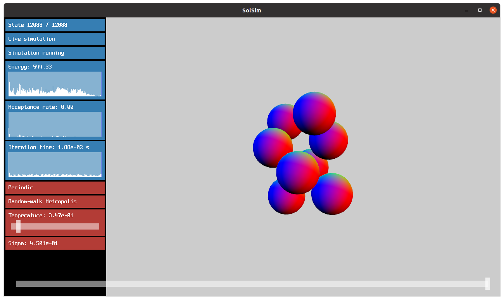

# SolSim.jl
SolSim.jl simulates solute molecules, modeled as a union of hard spheres, in an implicitly modeled hard sphere solvent. The solvation free energy of the system is calculated by the so called [morphometric approach](https://pubmed.ncbi.nlm.nih.gov/17026275/).

The computationally difficult part of this approach is to calculate geometric measures of a union of 3d balls. We utilize a [wrapped version](https://github.com/IvanSpirandelli/AlphaMol) of the [AlphaMol program](https://github.com/pkoehl/AlphaMol) written by [Patrice Koehl](https://www.cs.ucdavis.edu/~koehl/).

SolSim.jl is written in [Julia](https://julialang.org/).

To run SolSim.jl you will need to: 

1. Install and run Julia 1.7.3 or later

2. Build the SolSim.jl package

# Running the First Simulation
In the scripts folder you can find some useful helper functions to run simulations. 
To run a simulation for eight balls that has a helical configuration as the putative minimiser do:

        julia> include("scripts/hard_sphere_simulated_annealing_calls.jl")
        julia> single()  

Outputs are saved to "io/output/singles". See the function declaration for parameters you can adjust. 

The file "scripts/reproduction_calls.jl" contains several functions that scan the parameter space given by solvent radius, packing fraction and number of dissolved particles. The data generated by these functions is discussed in [this paper](TODO). 

 # Viusalization in Houdini

Look at generated output files in [Houdini](https://www.sidefx.com/). A Houdini project for this is included in the repository under "external_tools/sol_sim_visualizer.hipnc". The following two renders give an example:

<table>
  <tr>
    <td>Hard Spheres Assembled into Helix</td>
    <td>Corresponding Contact Graph</td>
  </tr>
  <tr>
    <td></td>
    <td></td>
  </tr>
 </table>

<!--
## Interactive Visualization Tool
To do this you will need to start Julia with more than one thread. Run `julia --threads 8` to start it with eight threads for example. 
After you have activated the SolSim.jl package run: 

        julia> using StaticArrays
        julia> Visualization.visualize_3d(Simulation.initialize_solute(@SVector[1.0, 1.0, 1.0, 1.0, 1.0, 1.0, 1.0, 1.0]))  

This will start up a GUI with eight hard spheres and default parameters for which these should assemble into a helix. The GUI was written by Lukas Mayrhofer from [TU Munich](https://www.tum.de/) and slightly adjusted to the needs of SolSim.jl.

The controls of the GUI are as follows.

- Use the mouse to zoom pan and rotate the viewport.
- The 's'-key starts the simulation
- 'Space' runs or stops the live visualization
- 'n' generates a new state.

See the following screenshot for an impression: 

Please reach out to me in case you have any questions or need support at spirandelli@uni-potsdam.de -->
