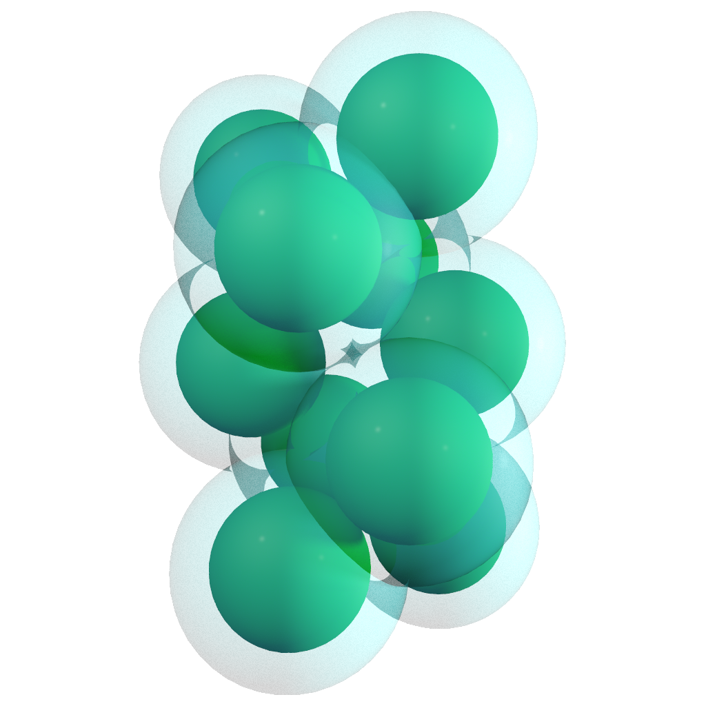
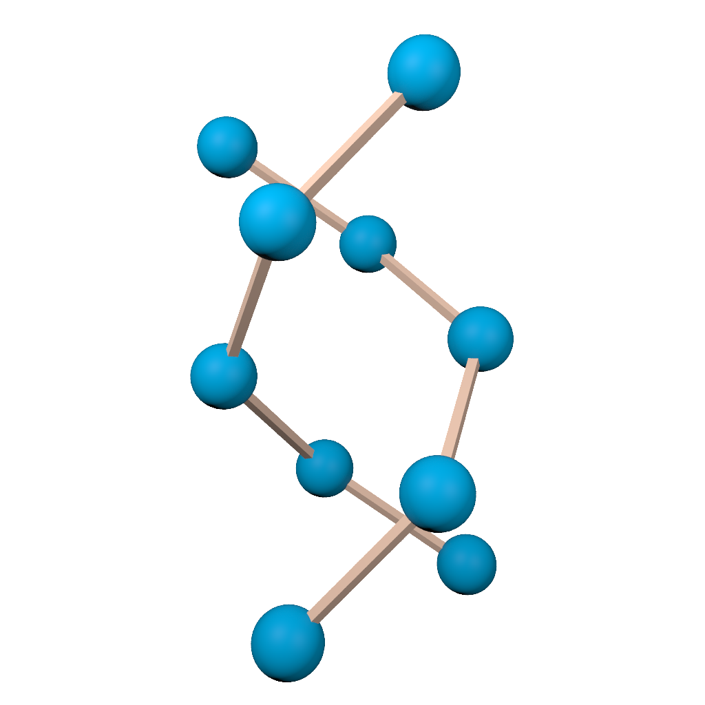

# SolSim.jl
SolSim.jl simulates solute molecules, modeled as a union of hard spheres, in an implicitly modeled hard sphere solvent. The solvation free energy of the system is calculated by the so called [morphometric approach](https://pubmed.ncbi.nlm.nih.gov/17026275/).

The computationally difficult part of this approach is to calculate geometric measures of a union of 3d balls. We utilize a [wrapped version](https://github.com/IvanSpirandelli/AlphaMol) of the [AlphaMol program](https://github.com/pkoehl/AlphaMol) written by [Patrice Koehl](https://www.cs.ucdavis.edu/~koehl/).

SolSim.jl is written in [Julia](https://julialang.org/).

To run SolSim.jl you will need to: 

1. Install and run Julia 1.7.3 or later

2. Build the SolSim.jl package

# Running the First Simulation
In the scripts folder you can find some useful helper functions to run simulations. 
To run a simulation for eight balls that has a helical configuration as the putative minimiser do:

        julia> include("scripts/hard_sphere_simulated_annealing_calls.jl")
        julia> single()  

Outputs are saved to "io/output/singles". See the function declaration for parameters you can adjust. 

The file "scripts/reproduction_calls.jl" contains several functions that scan the parameter space given by solvent radius, packing fraction and number of dissolved particles. The data generated by these functions is discussed in [this paper](TODO). 

 # Viusalization in Houdini

Look at generated output files in [Houdini](https://www.sidefx.com/). A Houdini project for this is included in the repository under "external_tools/sol_sim_visualizer.hipnc". The following two renders give an example:

<table>
  <tr>
    <td>Hard Spheres Assembled into Helix</td>
    <td>Corresponding Contact Graph</td>
  </tr>
  <tr>
    <td></td>
    <td></td>
  </tr>
 </table>

# A bug and its implications

When generating the data presented in the publication: [Exotic self-assembly of hard spheres in a morphometric solvent](https://www.pnas.org/doi/10.1073/pnas.2314959121) there was bug in the calculation of the geometric measures. The mean curvature can be decomposed into positive and negative parts, i.e. $C = C^+ + C^-$. The bug was that $C^-$ was counted twice. This led to the simulations being driven by the following energy

$E = p_{wb}V + \sigma_{wb} A + \kappa_{wb} C + \overline{\kappa}_{wb} X + \kappa_{wb} C^-,$

where $p_{wb}, \sigma_{wb}, \kappa_{wb}$ and $\overline{\kappa}_{wb}$ are the [white bear prefactors](https://arxiv.org/abs/cond-mat/0606658).

For a union of balls $\bigcup_{i} B_i$ with radii $r_i = R \in \mathbb{R}_{>0}$, the mean curvature $C$ can be written as

$C = C^+ + C^- = \sum_{i} \frac{A_i}{r_i+r_s} + C^- = \frac{1}{R+rs}\sum_{i} A_i + C^- = \frac{A}{R+rs} + C^-$

Therefor we can write $E$ as follows
$$
E = p_{wb}V + (\sigma_{wb} - \frac{\kappa_{wb}}{R+r_s})A+ 2\kappa_{wb} C +  \overline{\kappa}_{wb} X,
$$
which is the classic morphometric approach with a different set of prefactors. 

The white bear prefactors are give by:
$$
\beta p_{wb} = \frac{\eta}{r_s^3} \frac{3}{4\pi}\left(\frac{1+\eta+\eta^2-\eta^3}{(1-\eta)^3}\right),
$$
$$
\beta \sigma_{wb} = \frac{\eta}{r_s^2} \frac{3}{4\pi} \left( - \frac{1+2\eta+8\eta^2-5\eta^3}{3(1-\eta)^3} - \frac{\operatorname{ln}(1-\eta)}{3\eta}\right),
$$
$$
\beta \kappa_{wb} = \frac{\eta}{r_s} \frac{3}{4\pi} \left(\frac{4  -10\eta+20\eta^2-8\eta^3}{3(1-\eta)^3} + \frac{4\operatorname{ln}(1-\eta)}{3\eta}\right),
$$
$$
\beta \overline{\kappa}_{wb} = \eta \frac{3}{4\pi} \left(\frac{-4 + 11\eta -13 \eta^2+4\eta^3}{3(1-\eta)^3} - \frac{4\operatorname{ln}(1-\eta)}{3\eta}\right).
$$

